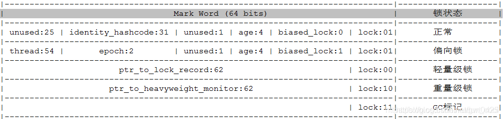

[TOC]

# 〇、wait / notify / notifyAll
[参考](https://www.cnblogs.com/joy99/p/10618910.html)
`wait`：线程自动释放其占有的对象锁，并等待notify
`notify`：唤醒一个正在wait当前对象锁的线程，并让它拿到对象锁
`notifyAll`：唤醒所有正在wait前对象锁的线程

`notify`和`notifyAll`的最主要的区别是：`notify`只是唤醒一个正在`wait`当前对象锁的线程，而`notifyAll`唤醒所有。值得注意的是：`notify`是本地方法，具体唤醒哪一个线程由虚拟机控制；`notifyAll`后并不是所有的线程都能马上往下执行，它们只是跳出了`wait`状态，接下来它们还会是竞 争对象锁。

---

**问：`sleep` 和 `wait` 方法的区别？**
>1. `sleep` 是线程的方法， `wait / notify / notifyAll` 是 `Object` 类的方法；
>2. `sleep` 不会释放当前线程持有的锁，到时间后程序会继续执行，`wait` 会释放线程持有的锁并挂起，直到通过 `notify` 或者 `notifyAll` 重新获得锁。

---

# 一、Synchronized
[深入理解synchronized底层原理，一篇文章就够了！](https://zhuanlan.zhihu.com/p/75880892)

## 0. 三种使用方式
1. **修饰普通方法**
   ```java
   //锁对象即为当前对象
   public synchronized void normalSyncMethod() {
      ...
   }
   ```
2. **修饰静态方法**
   ```java
   //锁对象为当前Class对象
   public static synchronized void staticSyncMethod() {
      ...
   }
   ```
3. **修饰代码块**
   ```java
   /**
    * 锁对象为synchronized紧接着的小括号内的对象
    *    synchronized(object/this)   锁对象为当前引用对象
    *    synchronized(Object.class)  锁对象为当前Class对象
    *
    * 使用 synchronized 加锁 class 时，无论共享一个对象还是创建多个对象，它们用的都是同一把锁。
    * 使用 synchronized 加锁 this 时，只有同一个对象会使用同一把锁，不同对象之间的锁是不同的。
    */    
   private static final Object object = new Object();
   public void syncBlockMethod() {
      synchronized (object) {
         ...
      }
   }
   ```

## 1. 锁特性(原子性,可见性,有序性,可重入性)
1. **原子性**
   > 原子性是指一个操作或者多个操作，要么全部执行并且执行的过程不会被任何因素打断，要么就都不执行。
   >```java
   >i = 0;     ---1
   >j = i;     ---2
   >i++;       ---3
   >i = j + 1; ---4
   >```
   >上面四个操作，只有1才是原子操作，其余均不是。
   >
   >1—在Java中，对基本数据类型的变量和赋值操作都是原子性操作；
    2—包含了两个操作：读取i，将i值赋值给j
    3—包含了三个操作：读取i值、i + 1 、将+1结果赋值给i；
    4—同三一样
   >
   >在单线程环境下我们可以认为整个步骤都是原子性操作，但是在多线程环境下则不同，Java只保证了基本数据类型的变量和赋值操作才是原子性的（注：在32位的JDK环境下，对64位数据的读取不是原子性操作*，如long、double）。要想在多线程环境下保证原子性，则可以通过锁、synchronized来确保。


2. **可见性**
   >可见性是指多个线程访问一个资源时，该资源的状态、值信息等对于其他线程都是可见的。
   >
   >`synchronized`和`volatile`都具有可见性，其中`synchronized`对一个类或对象加锁时，一个线程如果要访问该类或对象必须先获得它的锁，而这个锁的状态对于其他任何线程都是可见的，并且在释放锁之前会将对变量的修改刷新到主存当中，保证资源变量的可见性，如果某个线程占用了该锁，其他线程就必须在锁池中等待锁的释放。
   >
   >而`volatile`的实现类似，被`volatile`修饰的变量，每当值需要修改时都会立即更新主存，主存是共享的，所有线程可见，所以确保了其他线程读取到的变量永远是最新值，保证可见性。

3. **有序性**
   >有序性值程序执行的顺序按照代码先后执行。
   >
   >`synchronized`和`volatile`都具有有序性，`Java`允许编译器和处理器对指令进行重排，但是指令重排并不会影响单线程的顺序，它影响的是多线程并发执行的顺序性。`synchronized`保证了每个时刻都只有一个线程访问同步代码块，也就确定了线程执行同步代码块是分先后顺序的，保证了有序性。

4. **可重入性**
   > 通俗一点讲就是说一个线程拥有了锁仍然还可以重复申请本对象上的锁。

## 2. 锁升级
[Java Mark Word和锁](https://blog.csdn.net/gwt0425/article/details/109352362)  




**PS：锁可以升级但不能降级**
1. **无锁**
2. **偏向锁**
3. **轻量级锁/自旋锁**
4. **重量级锁**

## 3. 原理
`synchronized` 有两种形式上锁，一个是对**方法**上锁，一个是构造**同步代码块**。
他们的底层实现其实都一样，在进入同步代码之前先获取锁，获取到锁之后锁的计数器+1，同步代码执行完锁的计数器-1，如果获取失败就阻塞式等待锁的释放。只是他们在同步块识别方式上有所不一样，从 `class字节码` 文件可以表现出来，
一个是通过方法 `flags` 标志。
一个是 `monitorenter` 和 `monitorexit` 指令操作。

### 方法


> add方法的flags里面多了一个ACC_SYNCHRONIZED标志，这标志用来告诉JVM这是一个同步方法，在进入该方法之前先获取相应的锁，锁的计数器加1，方法结束后计数器-1，如果获取失败就阻塞住，知道该锁被释放。

### 代码块


>同步块是由 `monitorenter` 指令进入，然后 `monitorexit` 释放锁，在执行 `monitorenter` 之前需要尝试获取锁，如果这个对象没有被锁定，或者当前线程已经拥有了这个对象的锁，那么就把锁的计数器加1。当执行 `monitorexit` 指令时，锁的计数器也会减1。当获取锁失败时会被阻塞，一直等待锁被释放。

#### **问题: 同步代码块 为什么会有两个 `monitorexit` 呢？**
>其实第二个 `monitorexit` 是来处理异常的，仔细看反编译的字节码，正常情况下第一个 `monitorexit` 之后会执行 `goto` 指令，而该指令转向的就是23行的 `return` ，也就是说正常情况下只会执行第一个 `monitorexit` 释放锁，然后返回。
>
>而如果在执行中发生了异常，第二个 `monitorexit` 就起作用了，它是由编译器自动生成的，在**发生异常时处理异常然后释放掉锁**。
---

# 二、Lock
**问题为什么会在有了`Synchronized`的情况下，还设计`Lock`？** 
>`Synchronized`缺少申请不到进一步资源就释放已有资源的能力(比如死锁)。
以及其缺少如下能力。
>1. **能响应中断**   
   如果其他线程正在等待获取锁，则这个线程能够响应中断，即中断线程的等待状态。  
   当A和B两个线程同时通过 `lock.lockInterruptibly()` 想获取某个锁时，假若此时线程A获取到了锁，
   而线程B只有等待，那么对线程B调用 `threadB.interrupt()` 方法能够中断线程B的等待过程。  
   注意是：中断是等待的那个线程B，而不是正在执行的线程A。  
>2. **非阻塞式的获取锁**
   `boolean b = lock.tryLock()` 尝试进行获取锁，如果获取不到并不会阻塞，而是直接返回。
>3. **超时控制**
   `boolean b = lock.tryLock(long time, timeUnit)` 在给定的时间限制内，如果没有获取到锁，不是进入阻塞状态，而是同样直接返回。

---

## Lock使用范式
```java
    Lock lock = new ReentrantLock();
    lock.lock();

    try{
        ...
    } finally {
        lock.unlock();
    }
```
**问: 为什么在`try{}`外面获取锁，却在`finally`中释放锁?**
  >在 finally 释放锁，是为了保证在获取到锁之后，最终能被释放。    
  > 
  >在 try{} 外获取锁主要考虑两个方面:   
  >1. 如果在还没有获取到锁时抛出了异常，那么释放锁会有问题，未曾拥有锁谈何释放。
  >2. 如果在获取锁时抛出了异常，也就是当前线程并未获取到锁，但执行到 finally 代码时，如果恰巧别的线程获取到了锁，则会被释放掉（无故释放）。

---

**问题： `Lock`是怎样起到锁的作用呢？**
`synchronized`在编译成`CPU`指令后，会有`moniterenter`和`moniterexit`指令的出现。
- `lock.lock()`  获取锁，“等同于” `synchronized` 的 `moniterenter`指令
- `lock.unlock()` 释放锁，“等同于” `synchronized` 的 `moniterexit` 指令

`Lock` 是怎么做到的呢？
>其实很简单，比如在`ReentrantLock`内部维护了一个 `volatile` 修饰的变量 `state`，通过 **`CAS`** 来进行读写（最底层还是交给硬件来保证原子性和可见性），如果 **`CAS`** 更改成功，即获取到锁，线程进入到 `try`代码块继续执行；如果没有更改成功，线程会被【挂起】，不会向下执行。

---

**问: 什么是公平锁和非公平锁？**
> 公平锁：多个线程按照申请锁的顺序去获得锁，线程会直接进入队列去排队，永远都是队列的第一位才能得到锁。
>* 优点：所有的线程都能得到资源，不会饿死在队列中。  
>* 缺点：吞吐量会下降很多，队列里面除了第一个线程，其他的线程都会阻塞，cpu唤醒阻塞线程的开销会很大。  

>非公平锁：多个线程去获取锁的时候，会直接去尝试获取，获取不到，再去进入等待队列，如果能获取到，就直接获取到锁。
>* 优点：可以减少CPU唤醒线程的开销，整体的吞吐效率会高点，CPU也不必取唤醒所有线程，会减少唤起线程的数量。
>* 缺点：你们可能也发现了，这样可能导致队列中间的线程一直获取不到锁或者长时间获取不到锁，导致饿死。

---

**问: ReentrantLock 是如何实现公平锁和非公平锁的？**
> 公平锁就是判断同步队列是否还有先驱节点的存在，只有没有先驱节点才能获取锁；而非公平锁是不管这个事的，能获取到同步状态就可以

## ReentrantLock

## ReentrantReadWriteLock
[参考](https://www.cnblogs.com/zaizhoumo/p/7782941.html)
`ReentrantReadWriteLock`是`Lock`的另一种实现方式，我们已经知道了`ReentrantLock`是一个`排他锁`或者`独占锁`，同一时间只允许一个线程访问，而`ReentrantReadWriteLock`允许多个读线程同时访问，但不允许写线程和读线程、写线程和写线程同时访问。

相对于排他锁，提高了并发性。在实际应用中，大部分情况下对共享数据（如缓存）的访问都是读操作远多于写操作，这时`ReentrantReadWriteLock`能够提供比排他锁更好的并发性和吞吐量。

读写锁内部维护了两个锁`readerLock`和`writerLock`，一个用于读操作，一个用于写操作。所有`ReadWriteLock`实现都必须保证 `writeLock`操作的内存同步效果也要保持与相关`readLock`的联系。也就是说，成功获取读锁的线程会看到写入锁之前版本所做的所有更新。

1. 公平性：读写锁支持非公平和公平的锁获取方式，非公平锁的吞吐量优于公平锁的吞吐量，默认构造的是非公平锁

2. 可重入：在线程获取读锁之后能够再次获取读锁，但是不能获取写锁，而线程在获取写锁之后能够再次获取写锁，同时也能获取读锁

3. 锁降级：线程获取写锁之后获取读锁，再释放写锁，这样实现了写锁变为读锁，也叫锁降级


# 三、AQS(AbstractQueuedSynchronizer)队列同步器
>两个队列：同步队列(双向链表)，等待队列(单链表)

锁获取的核心，实际上是在try方法中定义的，在节点从阻塞中醒来时，都会用try方法来获取锁，而公平与否在try方法中体现，即在公平锁中，try获取的前提时需要没有存在前驱节点的，而非公平锁就没有这个限制  

但是！同步队列不是FIFO(先进先出)的吗，它们入队排好顺序并且按照顺序一个一个的醒来，只有醒来的才有机会去获取锁，才能去执行try方法，这不还是公平的吗？

解答

线程在do方法中获取锁时，会先加入同步队列，之后根据情况再陷入阻塞。当阻塞后的节点一段时间后醒来时，这时候来了新的更多的线程来抢锁，这些新线程还没有加入到同步队列中去，也就是在try方法中获取锁。
在公平锁下，这些新线程会发现同步队列中存在节点等待，那么这些新线程将无法获取到锁，乖乖去排队；
而在非公平锁下，这些新线程会跟排队苏醒的线程进行锁争抢，失败的去同步队列中排队。
因此这里的公平与否，针对的其实是苏醒线程与还未加入同步队列的线程
而对于已经在同步队列中阻塞的线程而言，它们内部自身其实是公平的，因为它们是按顺序被唤醒的，这是根据AQS节点唤醒机制和同步队列的FIFO特性决定的

AQS 内部维护了一个 同步队列 (双向链表)，用于管理同步状态。
当线程获取同步状态失败时，就会将当前线程以及等待状态等信息构造成一个 Node 节点，将其加入到同步队列中尾部，阻塞该线程
当同步状态被释放时，会唤醒同步队列中“首节点”的线程获取同步状态

为什么要是双向同步队列？
1. 入队的时候方便找到最后一个节点。
2. 在队列同步器中，头节点是成功获取到同步状态的节点，而头节点的线程释放了同步状态后，将会唤醒其他后续节点，
    后继节点的线程被唤醒后需要检查自己的前驱节点是否是头节点，如果是则尝试获取同步状态。
    所以为了能让后继节点获取到其前驱节点，同步队列便设置为双向链表，而等待队列没有这样的需求，就为单链表。

---

**问题：乐观锁与悲观锁？**
[参考](https://www.cnblogs.com/qjjazry/p/6581568.html)
1. **悲观锁**
   总是假设最坏的情况，每次去拿数据的时候都认为别人会修改，所以每次在拿数据的时候都会上锁，这样别人想拿这个数据就会阻塞直到它拿到锁。
   传统的关系型数据库里边就用到了很多这种锁机制，比如行锁，表锁等，读锁，写锁等，都是在做操作之前先上锁。
   `再比如Java里面的同步原语synchronized关键字的实现也是悲观锁。`
1. **乐观锁**
   顾名思义，就是很乐观，每次去拿数据的时候都认为别人不会修改，所以不会上锁，但是在更新的时候会判断一下在此期间别人有没有去更新这个数据，可以使用版本号等机制。
   乐观锁适用于多读的应用类型，这样可以提高吞吐量，像数据库提供的类似于write_condition机制，其实都是提供的乐观锁。
   `在Java中java.util.concurrent.atomic包下面的原子变量类就是使用了乐观锁的一种实现方式CAS实现的。`

---

**问题：什么是可重入锁？**
[参考](https://www.cnblogs.com/theRhyme/p/9133804.html)
指的是以线程为单位，当一个线程获取对象锁之后，这个线程可以再次获取本对象上的锁，而其他的线程是不可以的。

`synchronized 和   ReentrantLock 都是可重入锁。`

可重入锁的意义之一在于防止死锁。

实现原理实现是通过为每个锁关联一个请求计数器和一个占有它的线程。当计数为0时，认为锁是未被占有的；线程请求一个未被占有的锁时，JVM将记录锁的占有者，并且将请求计数器置为1 。

如果同一个线程再次请求这个锁，计数器将递增；
每次占用线程退出同步块，计数器值将递减。直到计数器为0,锁被释放。

---

**问题：一个线程执行synchronized同步代码时，再次重入该锁过程中，如果抛出异常，会释放锁吗？**
[参考](https://www.cnblogs.com/theRhyme/p/10078402.html)
如果锁的计数器为2，执行过程中抛出异常，锁的计数器直接置为0，会直接释放锁！

一个线程如果在执行同步代码块过程中抛出异常未捕获，会立即终止，退出同步代码块，并且释放锁，不会执行后续代码。

最核心的就是抛了异常，线程内部如果没处理，线程会直接停止！


# 四、Volatile
[深入分析volatile的实现原理](https://www.cnblogs.com/chenssy/p/6379280.html)
[volatile内存屏障及实现原理分析(JMM和MESI) - 极好](https://juejin.cn/post/6876395693854949389)
[Volatile和Happens-Before原则](https://blog.csdn.net/Sophia_0331/article/details/107473852)

`volatile` 可以保证线程可见性且提供了一定的有序性，但是无法保证原子性。在`JVM`底层 `volatile` 是采**内存屏障**来实现的。

>上面那段话，有两层语义
>1. 保证可见性、不保证原子性
>2. 禁止指令重排序

反编译出汇编指令后可以发现，加了volatile修饰之后打印出来的汇编指令多了lock是一种控制指令，在多处理器环境下，lock 汇编指令可以基于总线锁或者缓存锁的机制来达到可见性的一个效果。

## 硬件层面（可见性）
现代计算机系统都会增加一层读写速度尽可能接近处理器运算速度的高速缓存来作为内存和处理器之间的缓冲：将运算需要使用的数据复制到缓存中，让运算能快速进行，当运算结束后再从缓存同步到内存之中。

查看我们个人电脑的配置可以看到，CPU有L1,L2,L3三级缓存，其中L1和L2缓存为各个CPU独有。

为了解决缓存一致性问题，CPU层面提供了两种解决方法：**总线锁**和**缓存锁**

### 总线锁 和 缓存锁
**总线锁** 简单来说就是，在多CPU下，当其中一个处理器要对共享内存进行操作的时候，在总线上发出一个 LOCK#信号，这个信号使得其他处理器无法通过总线来访问到共享内存中的数据，总线锁定把 CPU 和内存之间的通信锁住了(CPU和内存之间通过总线进行通讯)，这使得锁定期间，其他处理器不能操作其他内存地址的数据。

然而这种做法的代价显然太大，那么如何优化呢？优化的办法就是降低锁的粒度，所以CPU就引入了**缓存锁**。

**缓存锁** 的核心机制是基于**缓存一致性协议**来实现的，一个处理器的缓存回写到内存会导致其他处理器的缓存无效，IA-32处理器和Intel 64处理器使用MESI实现缓存一致性协议(注意，缓存一致性协议不仅仅是通过MESI实现的，不同处理器实现了不同的缓存一致性协议)

### MESI（缓存一致性协议）
MESI表示缓存行的四种状态
> 1. M(Modify) 表示共享数据只缓存在当前 CPU 缓存中，并且是被修改状态，也就是缓存的数据和主内存中的数据不一致。
> 2. E(Exclusive) 表示缓存的独占状态，数据只缓存在当前CPU缓存中，并且没有被修改。 
> 3. S(Shared) 表示数据可能被多个 CPU 缓存，并且各个缓存中的数据和主内存数据一致。 
> 4. I(Invalid) 表示缓存已经失效 在 MESI 协议中，每个缓存的缓存控制器不仅知道自己的读写操作，而且也监听(snoop)其它CPU的读写操作。 

对于 MESI 协议，从 CPU 读写角度来说会遵循以下原则：
**CPU读请求**：缓存处于 M、E、S 状态都可以被读取，I 状态CPU 只能从主存中读取数据
**CPU写请求**：缓存处于 M、E 状态才可以被写。对于S状态的写，需要将其他CPU中缓存行置为无效才行。


MESI协议虽然可以实现缓存的一致性，但是也会存在一些问题：就是各个CPU缓存行的状态是通过消息传递来进行的。如果CPU0要对一个在缓存中共享的变量进行写入，首先需要发送一个失效的消息给到其他缓存了该数据的 CPU。

并且要等到他们的确认回执。CPU0在这段时间内都会处于阻塞状态。为了避免阻塞带来的资源浪费。

CPU中又引入了store bufferes，要在写入共享数据时，直接把数据写入到 store bufferes中，同时发送invalidate消息，然后继续去处理其他指令（异步） 当收到其他所有 CPU 发送了invalidate acknowledge消息时，再将store bufferes中的数据数据存储至缓存行中，最后再从缓存行同步到主内存。

但是这种优化就会带来了可见性问题，也可以认为是CPU的乱序执行引起的或者说是指令重排序(指令重排序不仅仅在CPU层面存在，编译器层面也存在指令重排序)。

其实从硬件层面很难去知道软件层面上的软件执行的前后依赖关系，所以没有办法通过某种手段自动去解决，故而CPU层面就提供了内存屏障(Memory Barrier，Intel称之为 Memory Fence),使得软件层面可以决定在适当的地方来插入内存屏障来禁止指令重排序。

### CPU层面的内存屏障
CPU内存屏障主要分为以下三类：
1. 写屏障(Store Memory Barrier)：
   > 告诉处理器在写屏障之前的所有已经存储在存储缓存(store bufferes)中的数据同步到主内存，简单来说就是使得写屏障之前的指令的结果对写屏障之后的读或者写是可见的。
2. 读屏障(Load Memory Barrier)：
   > 处理器在读屏障之后的读操作,都在读屏障之后执行。配合写屏障，使得写屏障之前的内存更新对于读屏障之后的读操作是可见的。
3. 全屏障(Full Memory Barrier)：
   > 确保屏障前的内存读写操作的结果提交到内存之后，再执行屏障后的读写操作。

通过以上内存屏障，我们就可以防止了指令重排序，得到我们预期的结果。
总的来说，内存屏障的作用可以通过防止 CPU 对内存的乱序访问来保证共享数据在多线程并行执行下的可见性，但是这个屏障怎么来加呢？回到最开始我们讲 volatile关键字的代码，这个关键字会生成一个 lock 的汇编指令，这个就相当于实现了一种内存屏障。接下来我们进入volatile原理分析的正题


## JVM层面（禁止指令重排序）
### JMM抽象模型结构
JMM 抽象模型分为主内存、工作内存；主内存是所有线程共享的，一般是实例对象、静态字段、数组对象等存储在堆内存中的变量。工作内存是每个线程独占的，线程对变量的所有操作都必须在工作内存中进行，不能直接读写主内存中的变量，线程之间的共享变量值的传递都是基于主内存来完成，可以抽象为下图：


从JMM的抽象模型结构图来看，如果线程A与线程B之间要通信的话，必须要经历下面2个步骤。 
1. 线程A把本地内存A中更新过的共享变量刷新到主内存中去。 
2. 线程B到主内存中去读取线程A之前已更新过的共享变量。
   
从整体来看，这两个步骤通信过程必须要经过主内存。

JMM通过控制主内存与每个线程的本地内存之间的交互，来为Java程序员提供内存可见性保证。


我们知道在执行程序时，为了提高性能，编译器和处理器常常会对指令做重排序。重排序分3种类型
>1. **编译器优化的重排序**
   编译器在不改变单线程程序语义的前提下，可以重新安排语句的执行顺序。
>2. **指令级并行的重排序**
   现代处理器采用了指令级并行技术来将多条指令重叠执行。如果不存在数据依赖性，处理器可以改变语句对应机器指令的执行顺序。
>3. **内存系统的重排序**
   由于处理器使用缓存和读/写缓冲区，这使得加载和存储操作看上去可能是在乱序执行。 

其中2和3属于处理器重排序，而这些重排序都可能会导致可见性问题。

编译器和处理器在重排序时会遵守数据依赖性，编译器和处理器不会改变存在数据依赖关系的两个操作的执行顺序，编译器会遵守**happens-before规则**和as-if-serial语义

### 内存屏障

### happens-before
我们所讨论的CPU高速缓存、指令重排序等内容都是计算机体系结构方面的东西，并不是Java语言所特有的。

事实上，很多主流程序语言(如C/C++)都存在多线程可见性的问题，这些语言是借助物理硬件和操作系统的内存模型来处理多线程可见性问题的，因此不同平台上内存模型的差异，会影响到程序的执行结果。

Java虚拟机规范定义了自己的内存模型JMM(Java Memory Model)来屏蔽掉不同硬件和操作系统的内存模型差异，以实现让Java程序在各种平台下都能达到一致的内存访问结果。

java1.5之后，通过happen-before原则增强了volatile关键词。volatile关键词是轻量的实现线程安全的方法，保证了volatile变量的有序性和可见性。

JVM定义的Happens-Before原则是一组偏序关系：对于两个操作A和B，这两个操作可以在不同的线程中执行。如果A Happens-Before B，那么可以保证，当A操作执行完后，A操作的执行结果对B操作是可见的。

Happens-Before原则约束了编译器的优化行为，虽允许编译器优化，但是要求编译器优化后一定遵守Happens-Before原则。即使编译器进行指令重排序的优化，如果结果和重排序前一致，也是允许的。

**问题：happen-before原则与 Volatile 是怎么关联的？**
当写一个 volatile 变量时，随后对该变量读时会创建一个 happens-before 关系。所以，所有在 volatile 变量写操作之前完成的写操作，将会对随后该 volatile 变量读操作之后的所有语句可见。

### 总结
1. CUP为了快速处理指令，设计了三个高速缓冲区，其中L1和L2缓存为各个CPU独有。
2. 高速缓冲区导致各个CPU之前缓存一致性问题，于是提出了总线锁，但是总线锁会严重影响性能，有提出了缓存锁，这就是缓存一致性协议。
3. 由于缓存一致性协议也会损耗性能，所以设计出指令重排序功能。
4. 指令重排序引起一致性问题，所以提出了内存屏障，从 CPU 以及 JVM的层面防止指令重排序。

所以 volatile 的原理就是添加lock指令，以及jvm层添加内存屏障

# 五、CAS
