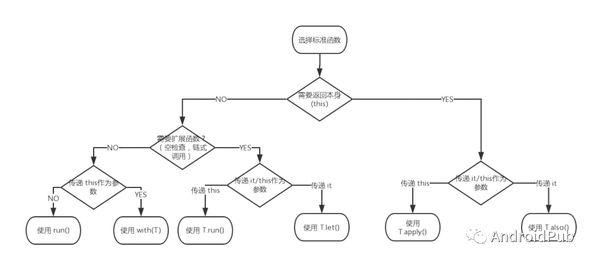

[Kotlin编译调校之WarningsAsErrors 压制警告](https://droidyue.com/blog/2019/08/03/kotlinc-config-warnings-as-errors/)

# 类和接口
private —— 意味着只在这个类内部（包含其所有成员）可见；
protected —— 和 private一样 + 在子类中可见。
internal —— 能见到类声明的 本模块内 的任何客户端都可见其 internal 成员；
public —— 能见到类声明的任何客户端都可见其 public 成员。

# 作用域函数 let & with & run & apply & also
## let
```java
// 函数定义
public inline fun <T, R> T.let(block: (T) -> R): R = block(this)
// 只有一个lambda函数块block作为参数的函数,并将该对象为函数的参数。
// 在函数块内可以通过 it 指代该对象。返回值为函数块的最后一行或指定return表达式。

// 使用时
object?.let {
    it.todo()
}

// 示例
val numbers = mutableListOf("one", "two", "three", "four", "five")
numbers.map { it.length }.filter { it > 3 }.let {
    println(it)
    // and more function calls if needed
}
```

---

## also
```java
// 函数定义
public inline fun <T> T.also(block: (T) -> Unit): T {
    block(this);
    return this
}

// 适用于任何let场景，also返回自身，可链式调用
// 略

// 示例
val numbers = mutableListOf("one", "two", "three")
numbers
    .also { println("The list elements before adding new one: $it") }
    .add("four")
```
---

## with
```java
// 函数定义
public inline fun <T, R> with(receiver: T, block: T.() -> R): R {
    return receiver.block()
}
// 使用时。不是扩展函数，而是把自身当做参数传进来
with(object){
    //todo
}

// 示例：
val numbers = mutableListOf("one", "two", "three")
with(numbers) {
    println("'with' is called with argument $this")
    println("It contains $size elements")
}
```
---
## run
```java
// 函数定义
public inline fun <T, R> T.run(block: T.() -> R): R {
    return block()
}

// 使用时
object.run{
    //todo
}

// 像let和with的结合。既方便判空，又能直接使用对象里的方法/变量
val numbers = mutableListOf("one", "two", "three")
val countEndsWithE = numbers.run { 
    add("four")
    add("five")
    count { it.endsWith("e") }
}
```

---

## apply
```java
// 函数定义
public inline fun <T> T.apply(block: T.() -> Unit): T {
    block()
    return this
}
// 和run区别：返回值不同（apply返回对象本身，可以链式）
// 略

val adam = Person("Adam").apply {
    age = 32
    city = "London"        
}
```

---

## takeIf & takeUnless
```java
// takeIf函数定义
public inline fun <T> T.takeIf(predicate: (T) -> Boolean): T? = if (predicate(this)) this else null

// takeUnless函数定义
public inline fun <T> T.takeUnless(predicate: (T) -> Boolean): T? = if (!predicate(this)) this else null


// 示例
val number = Random.nextInt(100)

val evenOrNull = number.takeIf { it % 2 == 0 }
val oddOrNull = number.takeUnless { it % 2 == 0 }
println("even: $evenOrNull, odd: $oddOrNull")
```

## 总结
| 函数名  | 函数体内使用的对象        | 返回值  | 适用的场景                             |
| ------ | ---------------------  | ------ | ------------------------------------ |
| let    | it指代当前对象           | 闭包    | 合并多处判断null的操作                  |
| with   | this指代当前对象，可省略  | 闭包    | 合并多个方法调用                        |
| run    | this指代当前对象，可省略  | 闭包    | let和with的结合体                      |
| apply  | this指代当前对象，可省略  | this   | 能用run的地方就能用apply，多用于初始化对象  |
| also   | it指代当前对象           | this   | 能用let就能用also，可用于函数链式调用      |



 # 属性委托 by
 
 一文彻底搞懂Kotlin中的委托
 https://mp.weixin.qq.com/s/dYBYuBAnYRgSiKQrU-ZGpg