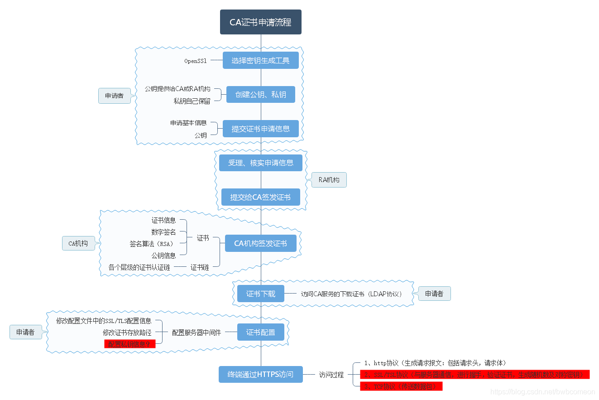

[TOC]

# TCP & UDP

## TCP

[TCP协议-如何保证传输可靠性](https://blog.csdn.net/liuchenxia8/article/details/80428157)
TCP协议保证数据传输可靠性的方式主要有：

1. 校验和
2. 序列号
3. 确认应答
4. 超时重传
5. 连接管理
6. 流量控制
7. 拥塞控制

[TCP重传机制](https://www.cnblogs.com/-wenli/p/13080675.html)

#### **五层网络体系是什么？**

> 1. 应用层
> 2. 传输层
> 3. 网络层
> 4. 数据链路层
> 5. 物理层

---

#### **问题：一个TCP & UDP包的大小？**

> **MTU：** 泛指通讯协议中的最大传输单元。一般用来说明TCP/IP四层协议中数据链路层的最大传输单元，不同类型的网络MTU也会不同，我们普遍使用的以太网的MTU是1500，即最大只能传输1500字节的数据帧。
>
> **UDP：** 包的大小为 1500(MTU) - IP头(20) - UDP头(8) = 1472(Bytes)
> **TCP：** 包的大小为 1500(MTU) - IP头(20) - TCP头(20) = 1460 (Bytes)

---

#### **问题：半和粘包？如何解决粘包问题？**

[参考](https://github.com/balloonwj/CppGuide/blob/master/articles/%E7%BD%91%E7%BB%9C%E7%BC%96%E7%A8%8B/TCP%E5%8D%8F%E8%AE%AE%E5%A6%82%E4%BD%95%E8%A7%A3%E5%86%B3%E7%B2%98%E5%8C%85%E3%80%81%E5%8D%8A%E5%8C%85%E9%97%AE%E9%A2%98.md)
> TCP 协议是流式协议，即协议的内容是像流水一样的字节流，内容与内容之间没有明确的分界标志，需要我们人为地去给这些协议划分边界。
>
> 注意：TCP 协议，在大多数场景下，是不存在丢包和包乱序问题的，TCP 通信是可靠通信方式，TCP 协议栈通过序列号和包重传确认机制保证数据包的有序和一定被正确发到目的地；如果是 UDP 协议，如果不能接受少量丢包，那就要自己在 UDP 的基础上实现类似 TCP 这种有序和可靠传输机制了（例如 RTP协议、RUDP 协议）。
>
> 先来解释一下什么是**粘包**？所谓粘包就是连续给对端发送两个或者两个以上的数据包，对端在一次收取中可能收到的数据包大于 1 个，大于 1 个，可能是几个（包括一个）包加上某个包的部分，或者干脆就是几个完整的包在一起。 当然，也可能收到的数据只是一个包的部分，这种情况一般也叫**半包**。
>
> 解决方案：想办法从收到的数据中把包与包的边界给区分出来。
> 1. 固定包长的数据包
     > 即每个协议包的长度都是固定的
> 2. 以指定字符（串）为包的结束标志
     > 这种协议包比较常见，即字节流中遇到特殊的符号值时就认为到一个包的末尾了。例如，我们熟悉的 FTP协议，发邮件的 SMTP 协议，一个命令或者一段数据后面加上"\r\n"（即所谓的 CRLF）表示一个包的结束。对端收到后，每遇到一个”\r\n“就把之前的数据当做一个数据包。
> 3. 包头 + 包体格式
     > 这种格式的包一般分为两部分，即包头和包体，包头是固定大小的，且包头中必须含有一个字段来说明接下来的包体有多大。
---

# HTTP & HTTPS

[一文看懂HTTPS、证书机构（CA）、证书、数字签名、私钥、公钥](https://www.jianshu.com/p/29e0ba31fb8d)

## HTTPS

**CA证书申请流程**

---

#### **问题：HTTPS证书怎么工作的？**

> 1. **申请证书：** 即需要被验证身份的一端，需要申请一份能够验证自己身份的证书
     > 用户向 CA 机构提交自己的信息（如域名）和公钥，由CA机构私钥加密后生成证书，交于服务器。
> 2. **验证证书：** 即需要验证对方身份的一端，拿到证书后验证对端的身份
     > 系统内置CA机构公钥，可以验证证书的合法性，并得到服务端公钥。

#### **问题：客户端是怎么校验CA证书合法性的？**

> 1. 先看CA证书的申请过程。  
     > 
> 2. 再看客户端的证书签名校验过程
     > 

---

## HTTP版本

◎HTTP 0.9（1991年）只支持get方法不支持请求头；

◎HTTP 1.0（1996年）基本成型，支持请求头、富文本、状态码、缓存、连接无法复用；

◎HTTP 1.1（1999年）支持连接复用、分块发送、断点续传；

◎HTTP 2.0（2015年）二进制分帧传输、多路复用、头部压缩、服务器推送等；

◎HTTP 3.0（2018年）QUIC 于2013年实现、2018年正式更名为HTTP3；

缺点：HTTP 2中，多个请求在一个TCP管道中的，出现了丢包时，HTTP 2的表现反倒不如HTTP 1.1了。 因为 TCP
为了保证可靠传输，有个特别的“丢包重传”机制，丢失的包必须要等待重新传输确认， HTTP 2出现丢包时，整个 TCP 都要开始等待重传，那么就会阻塞该TCP连接中的所有请求。 而对于 HTTP 1.1
来说，可以开启多个 TCP 连接，出现这种情况反到只会影响其中一个连接，剩余的 TCP 连接还可以正常传输数据。

#### **问题：GET 和 POST 区别？**

> 1. GET 请求在 URL 中传送的参数是有长度限制的，而 POST 没有。
> 2. GET 比 POST 更不安全，因为参数直接暴露在 URL 上，所以不能用来传递敏感信息。而 POST 数据不会显示在 URL 中。是放在 Request body 中。
> 3. 对参数的数据类型，GET 只接受 ASCII 字符，而 POST 没有限制。
> 4. GET 请求参数会被完整保留在浏览器历史记录里；相反，POST 请求参数也不会被浏览器保留。
> 5. GET 请求只能进行 url 编码（ application/x-www-form-urlencoded），而 POST 支持多种编码方式。
> 6. GET 请求会被浏览器主动缓存，而 POST 不会，除非手动设置。
> 7. GET 在浏览器回退时是无害的，而 POST 会再次提交请求。

---

#### **问题：Get、Post 请求发送的数据包区别？**

> 有理论说 GET 请求时产生一个TCP 数据包；POST 请求时产生两个TCP 数据包。
> > 1. GET：浏览器会把 http header 和 data 一并发送出去，服务器响应 200（返回数据；
> > 2. POST：浏览器先发送 header，服务器响应 100 continue，浏览器再发送 data，服务器响应 200 OK（返回数据）。
>
> 看起来POST理论上时间上消耗的要多一点，GET更有效率，但并不是。
> > 1. GET 与 POST 都有自己的语义，不能随便混用。
> > 2. 在网络环境好的情况下，发一次包的时间和发两次包的时间差别基本可以无视。而在网络环境差的情况下，两次包的 TCP 在验证数据包完整性上，有非常大的优点。
> > 3. 并不是所有浏览器都会在 POST 中发送两次包，Firefox 就只发送一次。

---

#### **问题：GET 可以像 POST 那样设置 Request body 么？**

> GET 和 POST 在本质上没有区别，都是 HTTP 协议中的两种发送请求的方法
> HTTP 的底层是 TCP/IP。所以 GET 和 POST 的底层也是 TCP/IP，也就是说，GET/POST 都是 TCP 链接。
> GET 和 POST 能做的事情是一样一样的。你要给 GET 加上 request body，给 POST 带上 url 参数，技术上是完全行的通的。

---

#### **问题：长连接为何需要心跳？**

[博客](https://mp.weixin.qq.com/s?__biz=MzIxNTM3NDE2Nw==&mid=2247486859&idx=1&sn=2d6b9c00dd60714bd7a5be2015833b52&chksm=97980db3a0ef84a57197a5c564ba2298d2882fc28e8ee52e856766e0cd48a687536bf1a6cf96&scene=132#wechat_redirect)
> 有很多种理由，举几个例子。服务器上有很多长连接，但是有些长连接可以释放了，比如用户合上笔记本下班回家了，网页也不需要再看了。
> 如果服务器发心跳报文自然得不到回复，那么就可以将长连接占据的内存释放掉。 还有类似BGP这种长连接，发送/接收周期性的心跳，可以快速检测底层网络的连通性，
> 可以快速完成网络物理链路的切换，将流量切换到连通的物理链路，毕竟底层网络才是真正的连接，才是真正搬运流量的载体！

[一篇搞懂TCP、HTTP、Socket、Socket连接池](https://mp.weixin.qq.com/s/00wm0tzz8Q1kUIQSlLXnUA)
[经得住拷问的 HTTPS 原理解析](https://mp.weixin.qq.com/s/KcW89_ohdxE4lgmKbEYoHg)
[这样回答GET和POST原理，面试官请我喝咖啡了](https://mp.weixin.qq.com/s/q-0s5Czi8uxGm5Hka-wbNw)

# QUIC

[科普：QUIC协议原理分析 (极度好文)](https://mp.weixin.qq.com/s/vpz6bp3PT1IDzZervyOfqw)
[QUIC 协议详解](https://zhuanlan.zhihu.com/p/405387352)
[关于QUIC Crypto](https://urchinzhou.com/post/%E5%85%B3%E4%BA%8Equic-crypto/)

## 连接迁移 (TCP的连接重连之痛)

> 一条 TCP 连接是由四元组标识的（源 IP，源端口，目的 IP，目的端口）。 什么叫连接迁移呢？就是当其中任何一个元素发生变化时，这条连接依然维持着，能够保持业务逻辑不中断。 当然这里面主要关注的是客户端的变化，因为客户端不可控并且网络环境经常发生变化，而服务端的 IP 和端口一般都是固定的。
> 比如大家使用手机在 WIFI 和 4G 移动网络切换时，客户端的 IP 肯定会发生变化，需要重新建立和服务端的 TCP 连接。
> 又比如大家使用公共 NAT 出口时，有些连接竞争时需要重新绑定端口，导致客户端的端口发生变化，同样需要重新建立 TCP 连接。
> 所以从 TCP 连接的角度来讲，这个问题是无解的。

**那 QUIC 是如何做到连接迁移呢？**

> 很简单，QUIC是基于UDP协议的，任何一条 QUIC 连接不再以 IP 及端口四元组标识，而是以一个 64 位的随机数作为 ID 来标识，
> 这样就算 IP 或者端口发生变化时，只要 ID 不变，这条连接依然维持着，上层业务逻辑感知不到变化，不会中断，也就不需要重连。
> 由于这个 ID 是客户端随机产生的，并且长度有 64 位，所以冲突概率非常低。

## 低连接延时 (TCP三次握手四次挥手的缺陷)

QUIC 由于基于 UDP，无需 TCP 连接，在最好情况下，短连接下 QUIC 可以做到 0RTT 开启数据传输。

要知道基于 TCP 的 HTTPS，即使在最好的 TLS1.3 的 early data 下仍然需要 1RTT 开启数据传输。 而对于目前线上常见的 TLS1.2 完全握手的情况，则需要 3RTT
开启数据传输。 对于 RTT 敏感的业务，QUIC 可以有效的降低连接建立延迟。

## 可自定义的拥塞控制

Quic使用可插拔的拥塞控制，相较于TCP，它能提供更丰富的拥塞控制信息。比如对于每一个包，不管是原始包还是重传包，都带有一个新的序列号(seq)，
这使得Quic能够区分ACK是重传包还是原始包，从而避免了TCP重传模糊的问题。

TCP重传模糊问题
> 客户端发送一个包，过了超时时间也没收到服务端的ack，那这时它会重新发送一遍刚才的数据包，过了一段时间后收到了ack，
> 但是已无法判断这个ack是第一个数据包还是第二个数据包的

## 无队头阻塞

虽然 HTTP2 实现了多路复用，但是因为其基于面向字节流的 TCP，因此一旦丢包，将会影响多路复用下的所有请求流。  
TCP 队头阻塞的主要原因是数据包超时确认或丢失阻塞了当前窗口向右滑动。

最容易想到的解决队头阻塞的方案是不让超时确认或丢失的数据包将当前窗口阻塞在原地。QUIC也正是采用上述方案来解决 TCP 队头阻塞问题的。

TCP 为了保证可靠性，使用了基于字节序号的 Sequence Number 及 Ack 来确认消息的有序到达。

QUIC 同样是一个可靠的协议，它使用 Packet Number 代替了 TCP 的 Sequence Number，并且每个 Packet Number 都严格递增，  
也就是说就算 Packet N 丢失了，重传的 Packet N 的 Packet Number 已经不是 N，而是一个比 N 大的值，比如Packet N+M。

